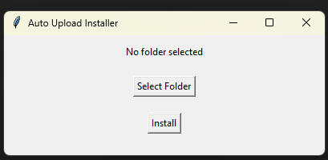
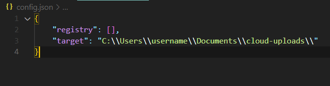
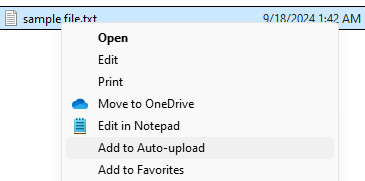

# Auto File Uploader
Select files to be observed and copied on change to a single target folder.

Basic use case is to sync files to the cloud by setting the target to a synced folder.

## Windows installer
- Start the installer script `install.cmd`.
- Choose the destination folder.
- Click install.

### The installer performs three actions:

- Creates a config file (in the same directory as the installer).

- Adds a context menu item to add file to the synced list.

- Schedules a 1-minute frequency task that monitors file changes.

## Syntax of the config file (`config.json`)
- `target`: Path to output director.
- `registery`: list of files to by synced.
- File format:
    - `name`: Output name in the synced directory.
    - `path`: Full path to file including file name.
    - `last-update`: The most recent timestamp the file was copied.
- `last-check`: Timestamp of the last uploader run.